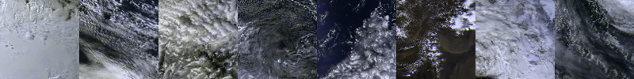
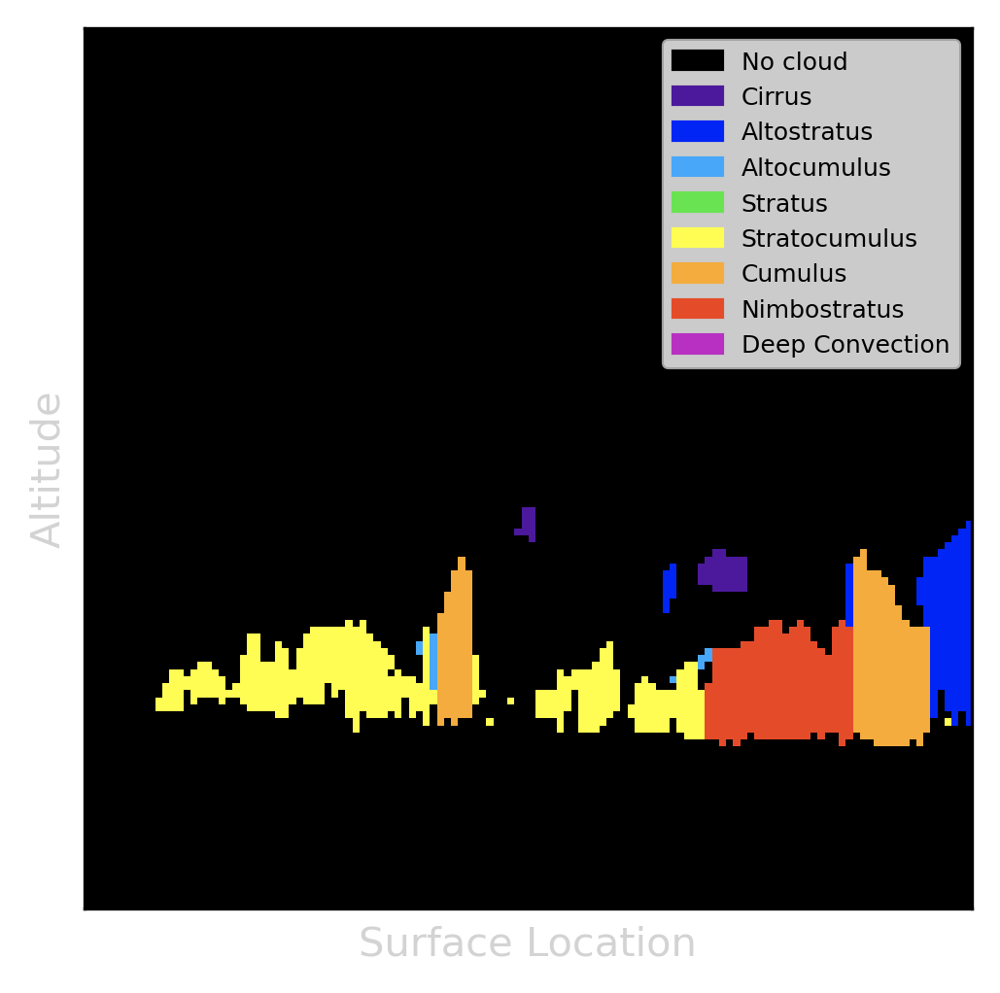

# A-Train Cloud Segmentation

Official GitHub repository for the A-Train Cloud Segmentation Dataset.

----------------------------------------------------------------
## Table of Contents

- [Overview](#overview)
- [Dataset](#dataset)
- [Models](#models)
- [Installation](#installation)
- [Usage](#usage)
- [Acknowledgements](#acknowledgements)

----------------------------------------------------------------
## Overview

The A-Train Cloud Segmentation Dataset (ATCS) is a large-scale, cloud segmentation dataset designed to make it easy for computer vision and remote sensing researchers to improve their cloud-finding models. This repository contains everything you need to interface with the dataset, to train or evaluate our baseline models, and even to generate your own version of the dataset.

If you're interested in machine learning or computer vision, you may find this dataset interesting because:
- It's large scale, with over 10k instances.
- It's easy to use; all instances are pre-processed numpy / pickle objects.
- Dataloaders and models are implemented in [Pytorch](https://pytorch.org/).
- Input images have 288 channels, posing a unique challenge.
- Labels are rich, containing cloud types for 125 altitude bins.
- Labels are sparse, making this an interesting test-case for sparse supervision.

If you come from the atmospheric remote sensing community, you may find this dataset interesting because:
- Multi-angle inputs and vertical cloud profile labels enable cloud-top height estimation, possibly overcoming parallax problems during Level-1C processing.
- Input contains 9 spectral bands, 3 of which have polarization values. As far as we know, this is the only similarly formatted large-scale cloud mask dataset containing polarization.

----------------------------------------------------------------
## Dataset

ATCS consists of data from multiple satellites in the [A-Train Constellation](https://atrain.nasa.gov/), synchronized spatially and temporally. The data is sourced from the publicly available [ICARE Data and Services Center](https://www.icare.univ-lille.fr/).

Instances are formatted as input/output pairs. The dataset contains over 10k pairs, split into training (80%) and validation (20%) sets.

Data is sampled equally across the globe, between 60°N and 60°S. Coverage is relatively uniform, and spans the globe:


Data is sampled randomly from 11/27/2007 to 12/2/2009, as this is the intersection of the operational lifetimes of the relevant missions, before orbital corrections caused an increase in the time delay between sensors.


### Input

Input comes from the [POLDER](https://www.eorc.jaxa.jp/ADEOS/Project/Polder.html) sensor on the [PARASOL](https://www.icare.univ-lille.fr/parasol/mission/) satellite. Input arrays are formatted as 100x100 patches, which are equirectangular projections centered on the patch center. Ground sample distance is approximately 6 km. Note: angles are imaged at different times, and clouds may drift between angles. Due to the high ground sample distance, this drift should rarely exceed 1 or 2 pixels.

Each pixel contains normalized reflectance values for 9 different spectral bands: 443, 490, 565, 670, 763, 765, 865, 910, 1020. In addition, the bands 490, 670, and 865 contain polarization information, represented as the Q, U values of the [Stokes parameterization](https://en.wikipedia.org/wiki/Stokes_parameters). Finally, there are three geometric values: relative azimuth angle, solar zenith angle, and view zenith angle, giving 18 total values, per angle, per pixel. With 16 angles and 18 values, inputs have a total of 288 channels. At inference time, model inputs have shape:
```
input_shape = (batch_size, num_channels=288, height=100, width=100)
```

Some examples images are shown below. These images are averaged over the 4 central angles, interpolated to simulate true color, and max-min normalized:



### Output

Outputs are not hand-labeled, and instead come from the [CloudSat](https://cloudsat.atmos.colostate.edu/) satellite. More specifically, we source the data from a [CALTRACK](https://www.icare.univ-lille.fr/calxtract/) product: [2B-CLDCLASS](http://www.cloudsat.cira.colostate.edu/data-products/level-2b/2b-cldclass) (vertical cloud profiles). The CloudSat data in this product are already time-synchronized with [CALIPSO](https://www-calipso.larc.nasa.gov/), therefore we use another CALTRACK product which contains time offsets between PARASOL and CALIPSO in order to ensure the records match within a maximum time offset threshold of 10 minutes.

Semantic segmentation involves predicting the class-membership mask of a single 'layer' of an image. However, our dataset contains vertical cloud profiles over 125 altitude bins. You can think of this as asking the network to simultaneously perform 125 (highly correlated) semantic segmentation tasks.

There are two main limitations of these outputs.
1. Since CloudSat's radar only acquires vertical cloud profiles in a narrow band, the output is only defined for a sparse set of locations in the input grid. This tends to look like a line running (mostly) through the input image from north to south. We constrain sampled locations so that there are at least 10 pixels between the output locations and the east/west borders of the image.
2. There is a temporal delay between POLDER and CLDCLASS measurements, so cloud locations may have slightly changed. Temporal offset tends to be within 3 minutes, so only the fastest-moving clouds will drift more than 1 pixel.

At inference time, outputs have shape:

```
output_shape = (batch_size, num_classes=9, num_altitude_bins=125, height=100, width=100)
```

An example label is displayed below:



The same example, displayed over its associated image. The green line shows the set of points for which we have supervision:


Ground truth is only defined on a sparse set of locations, with varying amounts of labeled locations per image. Additionally, these locations are not quantized to the same grid as the input. Therefore, before applying the loss function, we interpolate and reshape the output:

```
interpolated_shape = (num_pixels_in_batch, num_classes=9, num_altitude_bins=125)
```

Note: the interpolation function is differentiable, allowing the gradient to backpropagate to our model.

----------------------------------------------------------------
## Models

(TODO: experiments running)

----------------------------------------------------------------
## Installation
1. Clone this repository:

        git clone https://github.com/seanremy/atrain-cloudseg

2. Install python dependencies:

        conda create --name atrain python==3.9.5
        conda activate atrain
        python -m pip install -r requirements.txt -f https://download.pytorch.org/whl/torch_stable.html

3. Download and extract the dataset. You can download the dataset from [this (temporary) link](https://drive.google.com/file/d/1enZITkob80CocfINCTMUmXga8LEwOYzf/view?usp=sharing). Once you have the dataset downloaded, you can extract it with:

        tar -xzf <path/to/the/downloaded/file> -C <path/to/where/you/want/the/dataset>

4. Make the data and experiments directories, plus make a symbolic link to the dataset directory:

        mkdir data && mkdir experiments
        ln -s <path-to-extracted-dataset> data/atrain

----------------------------------------------------------------
## Usage

### Training

In order to see usage options, run:

        python scripts/train.py -h

### Evaluation

TODO: this is a work in progress.

### Leaderboard

TODO: the leaderboard is a work in progress.

### Dataset Generation

You can generate your own version of the dataset, if you'd like to get more data, or use a different set of generation hyperparameters. The dataset generation script manages a session with the [ICARE FTP server](https://www.icare.univ-lille.fr/data-access/data-archive-access/), where the original data lives. These files are in HDF5 or HDF4 formats, and in the case of the PARASOL data, the files are quite large.

In order to use this script, you first need to [register](https://www.icare.univ-lille.fr/register/) with ICARE. The script will ask you for your username and password at runtime. If you want to avoid constantly re-entering your credentials, you can store them in 'icare_credentials.txt', with username on the first line, and password on the second. CAUTION: If you do this, ensure that your ICARE password is unique, as storing unhashed passwords is extremely insecure.

You can configure patch size, sampling rates, maximum time offset, minimum number of angles, padding behavior, and which fields to take. In addition, the script is resumable (it can crash if your connection fluctuates or from occasional I/O file lock errors). In order to see usage options, run:

        python scripts/generate_atrain_dataset.py -h

After generating the dataset, you still need generate one or more train/val splits. To see usage for the split generation script, run:

        python scripts/generate_split.py -h

----------------------------------------------------------------
## Contributing

Feel free to open issues or contribute a pull request to this project! I appreciate any help. If you do so, make sure you use [pre-commit](https://pre-commit.com/), which will ensure everything is formatted correctly.

----------------------------------------------------------------
## Acknowledgements

Data provided by CNES and NASA. We thank the AERIS/ICARE Data and Services Center for providing access to the data used in this study.

The dataset and baselines were initially developed during my Summer 2021 internship at NASA's Goddard Space Flight Center. None of this work would be possible without the insights of my supervisor [Kirk Knobelspiesse](https://science.gsfc.nasa.gov/sed/bio/kirk.d.knobelspiesse), as well as [Andy Sayer](https://science.gsfc.nasa.gov/sed/bio/andrew.sayer), [Bastiaan van Diedenhoven](https://scholar.google.com/citations?user=68rQEXkAAAAJ&hl=en), [Carlos Del Castillo](https://science.gsfc.nasa.gov/sed/bio/carlos.e.delcastillo), and [Jason Xuan](https://ece.vt.edu/people/profile/xuan). I'd also like to thank my manager at SAIC, [Fred Patt](https://science.gsfc.nasa.gov/sed/bio/frederick.s.patt), and my advisors, [James Hays](https://www.cc.gatech.edu/~hays/) and [Judy Hoffman](https://www.cc.gatech.edu/~judy/).
